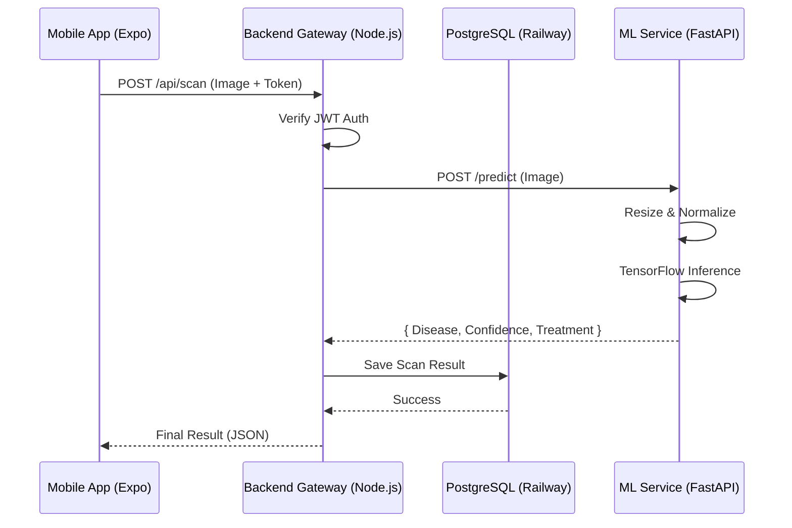

# 🌿 Krishi-Net: AI-Powered Plant Disease Detection System


> **Krishi-Net** is an intelligent mobile application that empowers farmers to detect plant diseases instantly using deep learning. Built with a scalable microservices architecture.

---

## 🏗️ Architecture

The system follows a modern **Microservices** pattern to ensure scalability and separation of concerns.



## 🚀 Tech Stack

- **Mobile**: React Native (Expo SDK 52), Reanimated, Expo Router.
- **Backend**: Node.js, Express, TypeScript, Prisma ORM.
- **Database**: PostgreSQL (hosted on Railway).
- **ML Engine**: Python, FastAPI, TensorFlow (Keras), NumPy.
- **DevOps**: Microservices deployed via Railway.

## ✨ Key Features

- **Real-time Detection**: Analysis in < 2 seconds.
- **Offline-First UI**: Smooth animations and optimistic UI updates.
- **Secure Auth**: JWT-based stateless authentication with SecureStore.
- **History Tracking**: Persist scan results for future reference.
- **Treatment Guide**: Automatically maps diseases to actionable cures.

---

## 🛠️ Getting Started

### Prerequisites
- Node.js & npm
- Python 3.10+
- Expo Go App on your phone

### 1. Backend Setup
```bash
cd backend
npm install
# Create .env file with DATABASE_URL, JWT_SECRET, ML_SERVICE_URL
npx prisma migrate dev
npm run dev
```

### 2. ML Service Setup
```bash
cd ml_service
pip install -r requirements.txt
python create_dummy_model.py # Generates initial model
python main.py
```

### 3. Mobile App (Expo)
```bash
cd mobile
npx expo install
npx expo start
# Scan QR code with your phone
```

---

## 👨‍💻 Author
**Shivam Singh**
*Full Stack Developer & AI Enthusiast*
